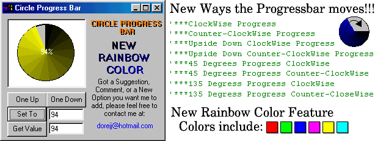



## Easy Circle Progressbar 2\.0

### Description

This is an update to my previous version of the Circular Progressbar. Improvements include "Rainbow style progress" and different directions of which the progressbar can progress. The jpg has bad colors and makes the rainbow look bad, download it, it looks better than what it shows. Try it, and don't forget to vote!
 
### More Info
 

             |
---                |---
**Submitted On**   |2000-11-17 05:08:42
**By**             |[Japeth Starlite](https://github.com/Planet-Source-Code/PSCIndex/blob/master/ByAuthor/japeth-starlite.md)
**Level**          |Intermediate
**User Rating**    |4.7 (42 globes from 9 users)
**Compatibility**  |VB 5\.0, VB 6\.0
**Category**       |[Custom Controls/ Forms/  Menus](https://github.com/Planet-Source-Code/PSCIndex/blob/master/ByCategory/custom-controls-forms-menus__1-4.md)
**World**          |[Visual Basic](https://github.com/Planet-Source-Code/PSCIndex/blob/master/ByWorld/visual-basic.md)
**Archive File**   |[CODE\_UPLOAD1178911172000\.zip](https://github.com/Planet-Source-Code/japeth-starlite-easy-circle-progressbar-2-0__1-12850/archive/master.zip)

